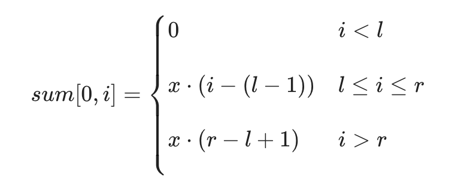
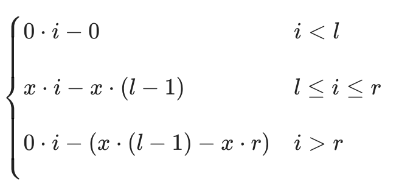
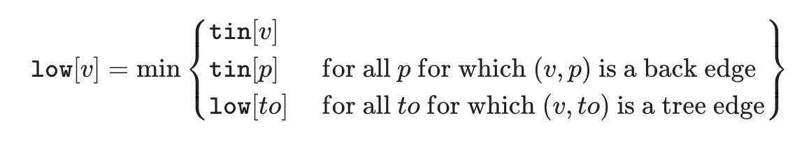

# Table of Contents

<!-- TOC -->
- [Table of Contents](#table-of-contents)
- [Data Structures](#data-structures)
  - [Sparse Table](#sparse-table)
  - [Trees](#trees)
    - [Segment Tree](#segment-tree)
    - [Segment Tree: Lazy Propagation](#segment-tree-lazy-propagation)
    - [Persistent Segment Trees: Range Update Range Query](#persistent-segment-trees-range-update-range-query)
    - [Bit Trees](#bit-trees)
      - [Iterative Segment Tree](#iterative-segment-tree)
      - [Binary Indexed Tree](#binary-indexed-tree)
      - [Binary Indexed Tree Range Update Point Query](#binary-indexed-tree-range-update-point-query)
      - [Binary Indexed Tree: Range Update Range Query](#binary-indexed-tree-range-update-range-query)
      - [Binary Indexed Tree: 2 Dimensions](#binary-indexed-tree-2-dimensions)
  - [DSU: Disjoint Set Union](#dsu-disjoint-set-union)
    - [Applications](#applications)
  - [Sqrt (Square root) Decomposition](#sqrt-square-root-decomposition)
    - [Sqrt Decomposition based data structure](#sqrt-decomposition-based-data-structure)
    - [MO's Algorithm](#mos-algorithm)
- [Algorithms](#algorithms)
  - [Binary Search](#binary-search)
    - [\[Ternary Search\]](#ternary-search)
  - [Bit Manipulation](#bit-manipulation)
  - [Dynamic Programming](#dynamic-programming)
  - [Array](#array)
    - [Longest Increasing Subsequence](#longest-increasing-subsequence)
  - [Pure BFS](#pure-bfs)
    - [Shortest path of even length](#shortest-path-of-even-length)
  - [Pure DFS](#pure-dfs)
    - [Entry \& Exit time keeping](#entry--exit-time-keeping)
    - [Iterative Dfs](#iterative-dfs)
  - [Graph Algorithms](#graph-algorithms)
    - [Bridge Finder: Offline](#bridge-finder-offline)
    - [Bridge Finder: Online](#bridge-finder-online)
    - [Articulation Point: Offline](#articulation-point-offline)
    - [Strongly Connected Components](#strongly-connected-components)
    - [Strong Orientation](#strong-orientation)
    - [Single Source Shortest Path: Dijkstra](#single-source-shortest-path-dijkstra)
<!-- /TOC -->


# Data Structures

This repository contains all my notes and snippets related to competitive programming.

## [Sparse Table](./CodeSnippets/SparseTable.cpp)

- Allows to calculate range queries which are cumulative on immutable arrays in logarithmic time instead of linear.
- Commonly used in finding Lowest Common Ancestor quries in a binary tree.

## Trees

### [Segment Tree](./CodeSnippets/Trees/SegmentTree.cpp)

Basic segment tree with range query and point update.

- Segment Trees can be used in descending the tree mode!
  - See [code](./CodeForces/1520.cpp)
  - Another example would be to get the index whose predix sum is greater than equal to k
    - Obviously the array can have updations otherwise we can just create a prefix array with
      binary search.
- Ranged Maximum subarray sum queries [code](./SPOJ/GSS3.cpp)
- **We can store the whole subtree in nodes**
  - This will result in a memory of **O(NlogN), not O(N^2)**
  - We can store the node data in special data structures like multiset to achive more functionality.
    - This is called **merge sort tree**.
  - Example Q: Find the smallest number greater or equal to a specified number with modification queries

### [Segment Tree](./CodeSnippets/Trees/SegmentTreeLazyPush.cpp): Lazy Propagation

This segment tree allows range updates and range queries both in log(n) time. You probably need
to **use lazy propagation whenever you require range updates**!

The crux behind the DS is in the following two points:

- If in a particular range update query, we are at a range `[l, r)` which is completely
  inside the update query range, then we will just update the lazy array index for this
  range and return.
- Now whenever you are descending into the tree, for each node in your path, just **push** the current
  lazy operation present in the lazy array down for both of it's children. This would be a `O(1)`
  operation assuming applying changes take `O(1)`.
- Example usage: [code](./CodeForces/1114F.cpp)

### [Persistent Segment Trees](./CodeSnippets/Trees/PersistentSegmentTree.cpp): Range Update Range Query

Firstly, think of a normal segment tree implementation with nodes as pointer to some node structure.
Now, in this tree, whenever we update some node, instead of updating the node, we create a new node with
the updated value and pass it on above. The above node again creates a new version of current node
and passes and it goes on. At the end, you get a new node for every update. Atmax there can be `O(height) == O(logN)`
new node creations per update query.

- => Still all operation works in `O(logN)`
- => You can store each new root node to get the updated version of the tree.
- => For any range query [l, r], let's we are in some point at the query step and say we want to calculate
  do some calulation based on the current node's value, then to get that, we can effectively do
  latest_version->value - previous_version->value.
  - This approach is useful in calculating numbers greater than k in [l, r] range.
  - Example [code](./SPOJ/KQUERY.cpp)
- Similary, a Persistent Segment Tree for range sum and range update (by some constant value) operations
  is implemented [here](./CodeSnippets/Trees/PersistentSegmentTree.cpp).

### Bit Trees

These trees use bitwise operations to calculate indices and store things efficiently.

#### [Iterative Segment Tree](./CodeSnippets/Trees/IterativeSegmentTree.cpp)

- Uses 2N memory
- Actual array is stored from [n, 2n)
- Each index i of tree stores value for i*2 and i*2 + 1
- Hence point updations are easy to think about
- Regarding range queries, see code for more explaination
  - Basically we normalise the ranges (+=n)
  - Then for every l, r, if they are odd, that means, it isn't covered in a whole range
    , hence we just thake it's value and move to a more complete range.

#### [Binary Indexed Tree](./CodeSnippets/Trees/FenwickTree.cpp)

- Uses N memory
- Used to store modifications, it's best get the result value by summing array value and
  modification value.
- Each index stores the value of the range some [g(i), i]. For a zero indexed tree
  - g(i) is defined as removing the rightmost set bits starting from the right most index.
    If there are no set bits from the right, then do nothing.
  - Let's say i is of the form some binary number "X" + "0000" + "1" * y times
  - Then all the j's where g(j) <= i <= j, can only have the middle zeros sset to 1 from the
    right. Because suppose we have a j of the form "X" + "0100" + "1" * y times, then g(j)
    would be equal to "X" + "0100" + "0" * y times, which is greater than i! Hence not possible.
  - Bit manipulation wise, if we wish to achive the functionality of h(i) => next j and g(i),
    it can we done as `h(i) = i | (i + 1)`, and `g(i) = i & (i + 1)`.
  - Sum of prefix i can be calulated recursively adding `[g[i], i]` and doing `i = g(i) - 1`.
  - In point updations, we need to update all the `j > i` which has `i` between `[g[j], j]`.
- For a 1 index based tree, we allocate tree size to be `n + 1` and transformations are:-
  - Here the ranges are half open to left => `(g[i], i]`
  - Hence the equalities in context are:
    - `g[i] < i`
    - `g[j] < i < j`
  - For g(i), we extract the last set bit.
  - For h(i), let's think of i as "X" + "001100"
    - If we set any bit to the right of last set bit, let's say j = "X" + "001110"
      then g(j) becomes "X" + "001100" which is not < i.
    - If we think of j = "X" + "001111", then g(j) becomes "X" + "001110" which is greater
      than i.
    - If we think of j = "X" + "011111", then g(j) becomes "X" + "011100" > i
  - Hence we can only set a bit to left of right most ones and remove all the rightmost ones
    i.e., j = "X" + "010000", then j > i and g(j) = "X" + "0" * 6 < i;
  - Moving onto the bit manipulations, last set bit is fetched through `i & (-i)`.
  - Hence `g[i] = i - (i & (-i))` and `h[i] = i + (i & (-i))`.

#### [Binary Indexed Tree](./CodeSnippets/Trees/FenwickRangeUpdatePointQuery.cpp) Range Update Point Query

- We can do this via hacks
- For update to range [l, r] by x each, we do `add(l, x)` and `add(r + 1, -x)`
- For getting the point value of a[i], the answer would be `prefix_sum(i)`

#### [Binary Indexed Tree](./CodeSnippets/Trees/FenwickTreeRangeUpdateRangeQuery.cpp): Range Update Range Query

- Let's think about the scenario, where we update a range `[l, r]` by x, then sum of a
  prefix i can be described as follows: <br/>
 
- We can write the sum as follows then: <br/>
 
- Now we can write the prefix sum as sum of two BIT tree B1 and B2 as
  - `sum[0, i] = sum(B1, i) * i - sum(B2, i)`, where
  - B1 contains updates in the form of `x`
  - B2 contains updates in the form of `x * (i - 1)`

#### [Binary Indexed Tree](./CodeSnippets/Trees/FenwickTree2D.cpp): 2 Dimensions

This is relatively simpler to implement compared to segment trees for 2 dimensions.

## [DSU](./CodeSnippets/Dsu.cpp): Disjoint Set Union

This is a very powerful data structure which would allow managing groups of elements. A classic dsu would have two operations:

- `join(a, b)`: would create union the groups where elements a and b lie.
- `find(a)`: find the group leader for a particular element. This leader is dymanic and at a point, only one
  element can be the leader.
kt
Classic Implementation would recursively check for the group leaders and take `O(n)` time in worst case. That's why we use two
optimizations:

- Path Compression
- Union by size / depth

Both of them are independent of each other and introduce a optimization of `O(logN)` individually. When used together, they make the
data structure perform is `Amortized O(1)`, meaning a single update might take `O(logN)` worst case but when operations are huge,
then the average time complexity of all the operations combined take `O(1)`, actually `O(ackerman(n))`.

> O(Ackerman(n)) is nearly 4 for 10^600. This seems intuitive from the fact that O(log(logN)) is < 3 for 10^600

Whenever you see that there is a directed dependency between elements and new dependencies are getting added and dependencies are only 1 outgoing and you want to instantly get the end of path, then think about dsu with just path compression! [code](./SPOJ/CLFLARR.cpp)

### Applications

- **Check Graph Bipartiteness**: You can check graph bipartiteness by joining the vertices which have an edge between them. If at any
  point of time, the vertices to be joined belong to the same group beforehand **and** that the leader distance parity is same for both, then the graph will voilate bipartiteness! Calculation of parity can be done in the `find` method. <br/>
  <details>
  <summary>Hint</summary>

  - For each vertex, also store the parity of it's length from the leader
  - For find operation
    - After join operations, it may happen that parent of a vertex isn't the leader right now.
    - If parent is the leader, then parity of vertex shouldn't change
    - Else, new parity will be xor of earlier and parent's parity. Reason being, if parent has some x parity to leader, and
      vertex also had x parity to parent, then the new length would have even length, hence zero parity, otherwise 1
  - For join operations
    - Get the leaders of the two
    - If leaders are same
      - If parity is same for both, the bipartite becomes false, mark the leader as false
    - Else, parity becomes xnor of both of them
  </details>
- **Arpa's Trick**: Offline RMQ: store parents as next smaller element. For a i, only answer queries with R == i. When go to i + 1, add the
  edges with next smaller element as i + 1.

> The idea of adding the smaller of the two values to bigger ones and balancing the overall set size
> is a very prominent concept of Computer Science! This always creates
> logarithmic complexity with multiple operations. Intuitive prove: Think about a particular element, when it is a part of operation
> , that means the operations resulted in atleast twice the size of element, next time, it will again grow twice...and so on. Hence over
> all, asymptotic complexity becomes O(NlogN).

- **Storing all group members in the DSU**: Due to the above thing, the asymptotic complexity of m queries on a dsu with n elements become
  `O(m + nlogn) asymptotically` <= `O(nlogn)` for the set maintanence, and original `O(1)` for each query.

## Sqrt (Square root) Decomposition

This is a technique that allows you to perform some common operations in `O(√N)`.

### Sqrt Decomposition based data structure

- We will divide the array into approximately length of `√N`
- Calculate the answer for each of this block
- For any [l, r] query, we first try to find the bucket bl and br for them
  - if `bl == br` => `r - l <= √N`, hence linear calculation will be `O(√N)`
  - else we'll linearly calculate the answers for both bl and br buckets in `O(√N)`
    each and for each intermediate buckets, add the whole answer for the bucket.
- Point updates are also simple, this can be done in `O(1)`
- For range updates, just like lazy propagation, we maintain a second array which will
  contain operations to be applied before delving linearly into the array.

### MO's Algorithm

This is a sqrt decomposition based algorithm where we divide the queries in a special way such that normal incremental computation
results in:

- For all queries in a particular block, for each query, the left pointer can move `√n`, and the right pointer in total would move `n`
- Let the queries for a block be x, then TC = `O(x√n + n)`
- Summing this for all the blocks, TC = `O(√nΣx + n√n)` == `O((m + n)√n)`

[Implementation](./CodeSnippets/MO-Algorithm.cpp)

---

# Algorithms

## [Binary Search](./CodeSnippets/BinarySearch.cpp)

- In questions where we need to find number of pairs satisfying a particular
  condition, we can fix the left boundary `l` and do lowerBound and upperBound searches
  and add the pairs with `l` and points between `lowerBoundIndex` and `upperBoundIndex`.

### [Ternary Search]

Incases where the evaluation function (`f(x)`) is first strictly non decreasing (or non increasing) for some x and then becomes stritly non increasing (or non decreasing) for rest of the x(s), we can employ ternary search.

> All intervals are half open

Let's say initial boundaries of x is `[l, r)`. Then for:

```text
d = (r - l) / 3;
m1 = l + d;
m2 = r - d;
```

Let `fm1 = f(m1 - 1)`, `fm2 = f(m2)`, then:

1) If `fm1 < fm2` => We won't see the peak on the left of m1, thus we can do `l = m1`.
2) If `fm1 > fm2` => We won't see the peak on the right of m2, thus we can do `r = m2`.
3) If `fm1 == fm2` => We won't see the peak on either of the boundaries, thus
we can do `l = m1 and r = m2`.

We can only run this search when we have **more than 4 elements**, as this requires four distinct
points `l, m1, m2, r`.

In code, this translates to:

```cpp
while (r - l > 4) {
    int d = (r - l) / 3;
    int m1 = l + d, m2 = r - d;
    auto fm1 = f(m1 - 1), fm2 = f(m2);
    if (fm1 >= fm2) l = m1;
    if (fm2 >= fm1) r = m2;
}
```

In the end, answer could be either of `l, l+1, l+2, l+3` (as r - l == 4).

Example question: [code](./CodeForces/439D.cpp)

## [Bit Manipulation](./CodeSnippets/BitManipulation.cpp)

- Finding AND of window which can decrease / increase is possible in O(1).

## Dynamic Programming

Nothing for notes as such,just remember

- When calculating some `ith` state, if you need to find the max of all smaller / greater element than i'th, then use
  binary search or set or segment tree.
- Some nice questions to know advance patterns:
  - [CSES: Elevator](https://cses.fi/problemset/task/1653)

## Array

This section mostly contains algorithms related to arrays

### Longest Increasing Subsequence

Apart from DP, we have a smart `O(nlogn)` solution.

```cpp
vi lis;
FORE(i, a) {
    auto it = lower_bound(all(lis), i);
    if (it == lis.end())
        lis.pub(i);
    else
        *it = i;
}
op(lis.size());
```

## Pure BFS

### [Shortest path of even length](./CodeSnippets/Graphs/ShortestPathOfEvenLength.cpp)

Find the shortest path of even length from a source vertex `s` to target vertex `t`.

Trick is to create an auxilary graph with vertices  `(v, 0)` and `(v, 1)` for each vertex `v`
and then for each edge `x -> y` in original graph, add edges `(x, 0)->(y, 1)` and `(x, 1)->(y, 0)`
in the auxilary graph. Then the answer is the shortest path from `(x, 0)` to `(y, 0)`.

## Pure DFS

### Entry & Exit time keeping

It's a very important technique in dfs to store the entry and exit time of each vertex in a dfs.
Many algorithms use this technique and it states some properties of vertex ordering.

For eg, in a tree, we can check if a node `A` is an ancestor to a vertex node `B` iff
`entry_time[A] < entry_time[B]` and `exit_time[A] > exit_time[B]`

### [Iterative Dfs](./CodeSnippets/Graphs/DfsIterative.cpp)

Iterative implementation of DFS (or any sort of recursion) us done by manually maintaining the
recursion stack.

## Graph Algorithms

### [Bridge Finder: Offline](./CodeSnippets/Graphs/BridgeFinderOffline.cpp)

Given undirected graph, find all the bridges.

**Algo**: Track two times for each vertex `v`:

- `tin[v]` : Entry time of `v`
- `low[v]` : Minimum time of a vertex from which this vertex `v` is reachable via a edge.
  *The edge should not come from it's parent*



Example problem: [code](./CodeForces/1986F.cpp)

### [Bridge Finder: Online](./CodeSnippets/Graphs/BridgeFinderOnline.cpp)

> **Glossary**: ***k-edge connected component***: It's a connected component which will remain
> connected if `< k` edges are removed from the connected component.

In a graph, if we compress each connected component into a single, node and then bridges would be
edges connected all of them.

Think about what can happen when we add an edge `a->b`:

- **Case 1**: If `a` and `b` lies in same 2-edge connected component, then nothing happens.
- **Case 2:** If `a` and `b` lies in same connected component, then it form a cycle with one or
  few of bridges.
- **Case 3:** If `a` and `b` lies in entirely different connected components, then this edge forms
  a bridge.

To implement this algorithm:

- We maintain the actual structure of the tree using a parent array.
- All the 2-ecc are compressed into a single vertex `leader` and all the operations concerning
  any of the member occurs through the leader.
- We use two DSU to store 2-edge connected components and connected components
- **Case 1:** Do nothing as the edges belong to the same 2-ecc.
- **Case 3:** Since the edges lie in entirely different components, we just have to:
  - Connect the two components: Here we would need to merge the smaller tree into bigger one.
  - Let's say we are merging a to b with a being the smaller tree than b. Then we have to
    first reroot tree_a at vertex a and then merge it with connected component leader of b.
  - Then merge this newly rooted tree at a to b's leader.
  - But maintain the structure as if a is joined to b.
  - Mark the current edge as a bridge.
- **Case 2:** We need to find the cycle in the compressed 2-ecc representation of the graph.
  All the edges in this cycle are briges and they would cease to exist as this cycle would form
  a new 2-ecc.

### [Articulation Point: Offline](./CodeSnippets/Graphs/ArticulationPointOffline.cpp)

The algorithm takes the exact same idea as the Bridge Finder offline algorithm.
There we claimed that if `tin[form] < low[to]` then `from->to` is a bridge.
Hence the node `from` must be an articulation point for sure.

But when `tin[from] == low[to]` => back edge from `from` or its childern comes back
to `from`, hence if we delete `from`, connected components will for sure increase.

What if `from` is a root node? Then if in a dfs traversal, dfs get invoked more than
one, that means graph has a structure something as follows:

```text
From
|-----Child graph 1
|-----Child graph 2
:...
:
```

Here child graph 1 would be independent of child graph 2 because if they were dependent,
then when child graph 2 would have been traversed by child graph 1's traversal.

**Hence**, the condition for articulation point is:

- For an edge, if `tin[from] <= low[to]`, then `from` is an articulation point.
- For a root, if childern traversal > 1, then `root` is an articulation point.

### [Strongly Connected Components](./CodeSnippets/Graphs/StronglyConnectedComponents.cpp)

> **Glossary**: ***Condensation Graph*** is a graph where all the strongly connected vertices
> are compressed into a single vertex and all the edges part of strongly connected components
> cease to exist.  
> Property: Condensation graph would always be acyclic (*otherwise there's still a scc present*
> *in there which we can condense*)

Algorithm:

- Find topological sort order
- Create a transpose graph and perform dfs in the toposort order.
  - The components traversed by each dfs is an scc
- To create a condensation graph, we can denote each scc with a new index
  and join using the extra edges.

### [Strong Orientation](./CodeSnippets/Graphs/StrongOrientationMinScc.cpp)

> **Glossary**: ***Strong orientation*** of an undirected graph is an assignment that makes the graph
strongly connected.

Problem Statement: Find the strong orientation of a graph so that scc count is minimial.

Thoughts: Bridges divide the graphs into SCCs.

Algo:

- Model the bridges in any direction, doesn't matters
- Model the dfs order in one direction (let's say `>`)
- Model the back edges in opposite direction (`<`)

### Single Source Shortest Path: [Dijkstra](./CodeSnippets/Graphs/Djkstra.cpp)

Main theorem: After any vertex `v` becomes marked, the current distance to it `d[v]` is the shortest
and will not longer change.

Time complexity analysis:

```text
For each vertex finally selected:
  For all its neighbours:
    Relax and erase -> insert the new node

    ||
    ||
    \/  

Independently, for each vertex, get it from set, iterate on neighbours: O(VlogV + E)
Independently, for each edge, there might be a relaxation: O(ELogV)

=> Total TC = (V + E)logV

```

---
